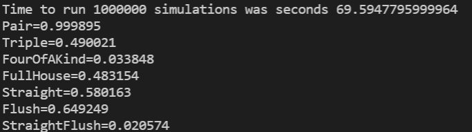

# BigTwoAnalyser
Python project to simulate various odds for the card game Big Two: https://en.wikipedia.org/wiki/Big_two

# Probabilities 
The calculations created so far are the probabilities of receiving the poker combinations from a starting hand of thirteen. To do this, run the script simulation.py. 
`src>python simulation.py`
* Output from program

After one million simulations
* Pair (`99.9895%`)
* Triple (`49.0021%`)
* FourOfAKind (`3.3848%`)
* FullHouse (`48.3154%`)
* Straight (`58.0163%`). Five cards in sequence (e.g. 6,7,8,9,10), including wrap around staights (e.g. K,A,2,3,4).=
* Flush (`64.9249%`) Five cards of the same suit.
* StraightFlush (`2.0574%`)

# Project Goal
The aim of the project is to calculate and display probabilities of winning against 1,2 or 3 opponents with a given hand and how best to play each hand.

# Tests
The project uses pytest. To run the tests, run pytest from the commandline. 
`>pytest`

# My Setup
Python is an interpretive language so if you have python installed, you can run the scripts directly. For development, I used the following tools:
* Visual Studio Code
* Python version 3.10
* Visual Studio Extensions: ms-python.python

# Thanks
This project was inspired by the many enjoyable games of Big Two in Norfolk 2021 that was first taught to both Roger Butler and myself by Guille Phillips. Guille also went on to write the first Big Two Analyser in `php`. Thanks for the inspiration Guille!

# Help
https://docs.docker.com/language/python/build-images/

# Docker
To build the docker image, cd to BigTwoAnalyser. `docker build --tag hello-docker .`
To run the docker image. `docker run -d -p 5000:5000 hello-docker`
Then test with `curl localhost:5000`

# Quality Control

