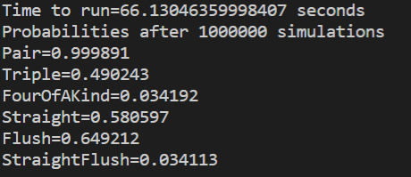

# BigTwoAnalyser
Python project to simulate various odds for the card game Big Two: https://en.wikipedia.org/wiki/Big_two

# Probabilities 
The calculations created so far are the probabilities of receiving the poker combinations from a starting hand of thirteen. To do this, run the script simulation.py. 
`>python simulation.py`
* Output from program

After one million simulations
* Pair (`99.9899%`)
* Triple (`48.988%`)
* FourOfAKind (`3.4036%`)
* Straight (`58.05%`). Five cards in sequence (e.g. 6,7,8,9,10), including wrap around staights (e.g. K,A,2,3,4).=
* Flush (`64.8207%`) Five cards of the same suit.
* StraightFlush (`3.4254%`)

# Project Goal
The aim of the project is to calculate and display probabilities of winning against 1,2 or 3 opponents with a given hand and how best to play each hand.

# Tests
The project uses pytest. To run the tests, run pytest from the commandline. 
`>pytest`

# My Setup
Python is an interpretive language so if you have python installed, you can run the scripts directly. For development, I used the following tools:
* Visual Studio Code
* Python version 3.10
* Visual Studio Extensions: ms-python.python
